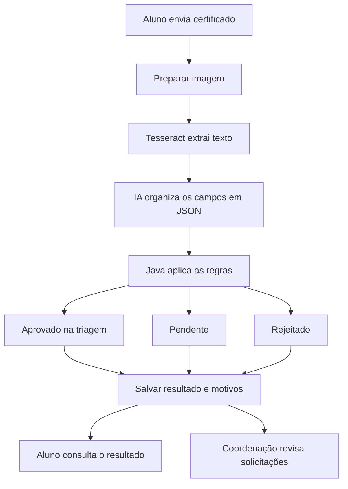

Validação de Certificados de Atividades Complementares
Projeto acadêmico para auxiliar a conferência de certificados de cursos livres e oficinas apresentados por estudantes para aproveitamento de horas complementares.
Autor: Luis Lucena Wanderley Galindo
Curso: Análise e Desenvolvimento de Sistemas - CESAR School
Semestre: 2026.2
Professor: Kleber Meira
Status: planejamento inicial. Este repositório documenta a proposta; a aplicação e as integrações serão desenvolvidas ao longo do semestre.

Problema
A conferência manual de certificados exige que a coordenação leia cada documento, identifique o aluno, verifique datas e registre a carga horária. Informações incompletas e envios repetidos geram retrabalho e dificultam o acompanhamento das solicitações.
O projeto propõe uma triagem automatizada que extraia os dados, aplique regras e apresente o resultado com motivos claros. A decisão acadêmica final continuará sob responsabilidade da coordenação.
Quem utiliza
- Aluno: envia o certificado, acompanha o resultado e reenvia documentos com pendências.
- Coordenação ou secretaria acadêmica: consulta os dados extraídos, revisa pendências e confirma as horas aproveitadas.
Documentos e dados
O MVP atenderá certificados de cursos livres e oficinas em modelos previamente selecionados. Será aceito um certificado de uma página por envio, em PDF, JPG ou PNG, vinculado a um aluno cadastrado.
Campo	Obrigatório
Nome do participante	Sim
Título da atividade	Sim
Instituição emissora	Sim
Carga horária total	Sim
Data de início	Sim
Data de término	Sim
Data de emissão	Sim
Código de identificação do certificado	Não

Informações não encontradas deverão retornar null. A IA não deverá inventar nem completar dados ausentes. O nome e a data de ingresso do aluno serão obtidos do cadastro para comparação.
Regras propostas
As regras abaixo são demonstrativas e deverão ser ajustadas ao regulamento da instituição antes de um uso real.
1. Os campos obrigatórios devem estar presentes e legíveis.
2. O nome do participante deve corresponder ao cadastro, desconsiderando acentos, diferenças entre maiúsculas e minúsculas e espaços extras. Abreviações ou outras divergências serão encaminhadas para revisão.
3. A carga horária deve ser numérica e maior que zero.
4. A data de início não pode ser posterior à data de término.
5. A emissão deve ocorrer entre o término da atividade e a data do envio, incluindo essas datas.
6. A atividade deve ter começado na data de ingresso do aluno ou depois dela.
7. Um arquivo idêntico já aprovado para o mesmo aluno será considerado duplicado. O mesmo emissor e código de certificado já aproveitados também indicarão duplicidade.
8. Sem código de identificação, coincidências de atividade, datas e emissor serão encaminhadas para revisão, sem rejeição automática.
Resultados da triagem
Status	Quando utilizar	Próximo passo
APROVADO_NA_TRIAGEM	Campos claros e todas as regras atendidas	Conferência final pela coordenação
PENDENTE	Campo ausente, leitura insuficiente, nome ambíguo ou possível duplicidade	Reenvio ou revisão humana
REJEITADO	Duplicidade confirmada ou descumprimento claro de uma regra	Exibir o motivo ao aluno

A aprovação na triagem não comprova a autenticidade do documento nem confirma automaticamente o aproveitamento das horas. A decisão final e sua justificativa serão registradas pela coordenação. Falhas técnicas deverão permitir nova tentativa, sem classificar o certificado como rejeitado.
Fluxo planejado

Arquivos PDF serão convertidos em imagem antes do tratamento com OpenCV. A IA será responsável pela estruturação dos dados; as regras de decisão serão implementadas em Java.
Tecnologias planejadas
Tecnologia	Papel no projeto
Java 21	Implementação da aplicação e das regras
Spring Boot	API REST e organização do backend
Maven	Gerenciamento de dependências e execução
OpenCV	Tratamento de imagens para facilitar a leitura
Tesseract OCR	Extração do texto das imagens
API de IA	Organização do texto extraído em JSON
PostgreSQL	Armazenamento dos dados e resultados
Interface web	Envio, consulta e revisão das solicitações

A ferramenta de conversão de PDF em imagem e a tecnologia da interface serão definidas durante o desenvolvimento.
MVP
A primeira versão demonstrável deverá permitir:
- Enviar um certificado vinculado a um aluno cadastrado.
- Processar o documento com OpenCV, Tesseract e uma API de IA.
- Validar os campos, o participante, as datas, a carga horária e a duplicidade.
- Salvar dados extraídos, status e motivos, mantendo acesso ao original para revisão.
- Consultar o resultado e reenviar documentos com pendências.
- Registrar a decisão da coordenação, separando horas em triagem de horas confirmadas.
A demonstração utilizará documentos sintéticos.
Fora do escopo inicial
- Consulta automática aos emissores dos certificados.
- Comprovação de autenticidade ou detecção conclusiva de fraude.
- Suporte a qualquer modelo de certificado.
- Integração com o sistema acadêmico da instituição.
- Aplicação de um regulamento acadêmico completo de categorias e limites de horas.
Etapas de desenvolvimento
- [x] Definir o problema, os usuários, as regras e o MVP.
- [x] Elaborar a documentação inicial.
- [ ] Criar a estrutura Java com Spring Boot e Maven.
- [ ] Implementar uma primeira API com dados de certificado enviados em JSON.
- [ ] Implementar e testar as regras de validação.
- [ ] Adicionar recebimento e preparação de arquivos.
- [ ] Integrar Tesseract e OpenCV.
- [ ] Integrar a API de IA para estruturar o texto.
- [ ] Implementar persistência e consulta dos resultados.
- [ ] Criar a interface de envio e revisão.
- [ ] Preparar a demonstração final.
As primeiras etapas utilizarão dados estruturados de teste para validar as regras antes da integração com OCR e IA. Cada avanço será registrado em commits com mensagens que descrevam as alterações realizadas.
Cenários de teste previstos
Cenário	Resultado esperado
Certificado completo e consistente com o cadastro	Aprovado na triagem
Mesmo certificado já aprovado para o aluno	Rejeitado por duplicidade
Imagem sem carga horária legível	Pendente para reenvio
Emissão anterior ao término da atividade	Rejeitado por inconsistência de datas
Nome abreviado que não corresponde diretamente ao cadastro	Pendente para revisão
Falha no serviço de OCR ou IA	Erro de processamento com possibilidade de nova tentativa

Execução
A aplicação ainda não está implementada. As instruções de instalação, configuração e execução serão adicionadas quando a estrutura inicial estiver disponível.
Chaves de API e credenciais serão configuradas por variáveis de ambiente e não deverão ser incluídas nos commits. Os exemplos do repositório utilizarão dados fictícios.
Referência da atividade
O projeto segue o fluxo didático apresentado pelo professor: documento, tratamento da imagem, OCR, estruturação com IA e validação em Java.
Repositório de referência: KleberMeira/analise-documento-ia
